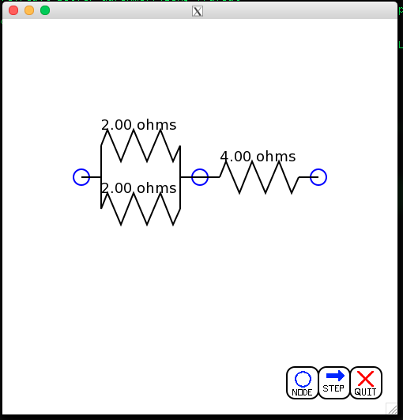
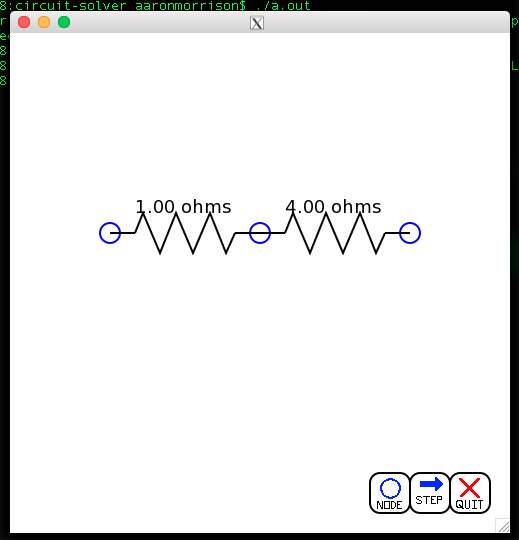
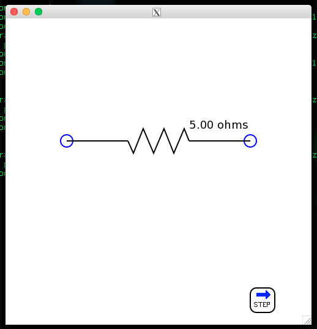

Circuit Solver
==============

description
-----------
graphical tool for solving resistor maps.

uses cairo on top of xlib windowing, so it can be used over x11 forwarding

currently is somewhat interactive, as circuits can be reduced, nodes can be added and one resistor can be reduced via clickable buttons. There are currently three working buttons (see screenshot), one to add a node, one to solve for the resistor map one step at a time, and one to quit the program nicely.

nodes can be dragged around with the mouse, as can the buttons. not extremely useful, but fun to do.

screenshots
-----------
so I mocked up a circuit with three nodes and three resistors

hitting the step button (bottom right corner) will reduce the parallel resistors

hitting the step button again will combine the two now series resistors

