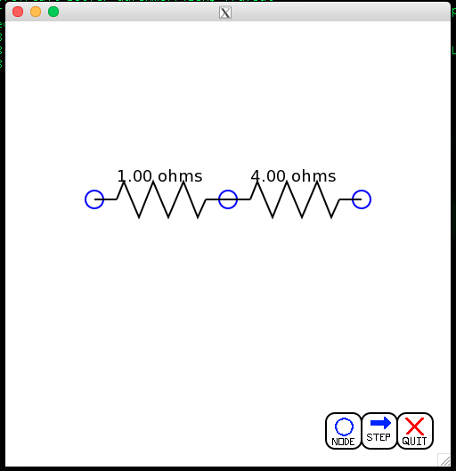

Circuit Solver
==============

So I was sitting in circuits class one day, doing a question on combining about 15 resistors into a single equivalent resistance.

I did it all in one line, and wanted a way to check my work. Given that I didn't want to actually build the damn thing and get a multimeter out, I googled "online resistance solver" assuming I'd find some 100mb jquery monstrosity which I could use to verify my answer. Unfortunately, I didn't find anything.

So I decided to build my own. Immediately realizing that I know very little about interactive browser graphics, I decided to write it in c++. This is what I have now.

description
-----------
graphical tool for solving resistor maps.

uses cairo on top of xlib windowing, so it can be used over x11 forwarding

currently is somewhat interactive, as circuits can be reduced, nodes can be added and one resistor can be reduced via clickable buttons. There are currently three working buttons (see screenshot), one to add a node, one to solve for the resistor map one step at a time, and one to quit the program nicely.

nodes can be dragged around with the mouse, as can the buttons. not extremely useful, but fun to do.

screenshots
-----------
so I mocked up a circuit with three nodes and three resistors

hitting the step button (bottom right corner) will reduce the parallel resistors

hitting the step button again will combine the two now series resistors

current problems/things to fix
------------------------------

should this entire list be taken out of the readme and submitted as issues? yes.

However I feel this program is young enough (earliest of early alphas I guess?) that I had might as well put them here.

####1. Sometimes thigs disappear

   You may have noticed in the 3rd screenshot about that the quit and add node buttons disappeared. This just happens sometimes. You click something, or drag something, or move the window, or sneeze accidentally, and the screen goes blank, and then one frame later, none, some, or all of the elements reappear.
  I don't know why this is. I'm guessing it has something to do with cairo throwing an error and it not being caught. This is at the top of my list because it kinda breaks the programs a little bit, and it would be really nice to fix
  Note, the buttons still work even if they're not displayed, which is kinda weird

####~~2. You can't add resistors

  You can currently add nodes by hitting the new node button, which creates a new node at (20,20) which you can then drag to wherever. There's currently no point in doing this, as you can't add anything to the node. Currently I add all the resistors manually in the main function with `Circuit::add_resistor`
  The reason I haven't fixed this yet is because it requires having a resistance value inputted by the user, probably via the keyboard, and whenever you let a user input anything, you introduce thousands of things which can go wrong. It would make the program much more useful, but it's not as important as fixing the graphical bugs, which make this very difficult to use ~~ gosh darn does it ever feel good to cross that one out

####3. It's a tangled mess of spaghetti code which has almost no comments or documentation making it entirely unreadable and impossible to maintain

   That might be slightly dramatic. It's currently not that bad, and almost follows an MVC model with the `Circuit` class taking care of all the backend math and such and `Graphical` dealing with all the input and display stuff, but I'd like to split the latter into a true view and controller. Documentation does need work, but is not as pressing as the bugs above

####4. It's only resistors/poorly named

   This program only solves for equivalent resistances, and it would be nice to add voltage/current sources and be able to solve for voltages/currents/power consumption. This is obviously a "down the road" kinda thing, so it's at the end of the list, but it would make circuits class much easier

basic documentation/class layout-y map
--------------------------------------

So there are two important classes in this program. There's `Circuit` and `Graphical`

`Circuit` is the model of the circuit, it has nodes in it. `Node` is a class which has `Resistors` (another class) attached to them. `Circuit` has functions 

   `add_resistor(a,b,r)` which connects nodes[a] and nodes[b] with a `Resistor` of resistance r.

   `step` which combines two resistors and may delete a node. Parallel first, series second

   `minimize` which steps as far as it can. Usually winds up with just one resistor left.

`Graphical` is the displayer class, handles all the x11 and cairo nonsense that makes my head hurt to think about. It handles `Button` class, and has methods

  `loop`, the only one that the user should ever call. It's the main loop, call it and `Graphical` does the rest.
